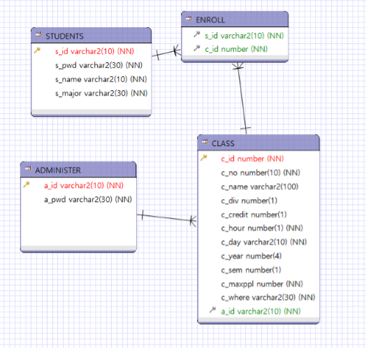
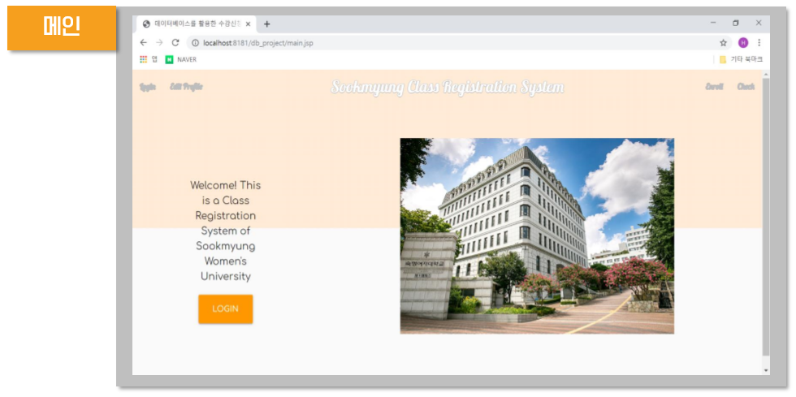
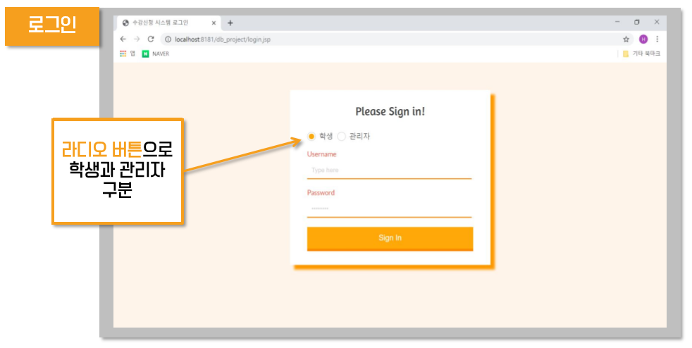

# 수강 신청 시스템
Class enrollment

## DB 설계도

-	STUDENTS 테이블
: s_id[학번]을 PRIMARY KEY로 갖는다.
그 외에 s_pwd[비밀번호], s_major[전공]을 갖는다.
-	ENROLL 테이블
: s_id[학번], c_id[과목번호]를 각각 STUDENTS 테이블과 CLASS 테이블을 참조하는 FOREIGN KEY로 갖는다.
-	ADMINISTER 테이블
: a_id[관리자ID]를 PRIMARY KEY로 갖는다.
그 외에 a_pwd[관리자 비밀번호]를 갖는다.
-	CLASS 테이블
: c_id[과목ID]를 PRIMARY KEY로 갖는다.
a_id[관리자ID]를 FOREIGN KEY로 갖는다.
그 외에 c_no[과목번호], c_name[과목명], c_div[분반], c_credit[학점], c_hour[강의시간(교시)], c_day[강의요일], c_year[수강연도], c_sem[수강학기], c_maxppl[수강정원], c_where[장소]를 갖는다.

## 기능

### 1. 메인 홈페이지
홈페이지에 들어갔을 때의 메인 홈페이지 구현

### 2. 로그인
라디오 버튼으로 학생과 관리자 구분하는 기능 추가

### 3. 학생
#### 1) 정보수정
- Prepared Statement 사용: UPDATE 문으로 정보 수정
- StudentInfoUpdate TRIGGER
1.  비밀번호가 4자리보다 짧을 때 
2. 비밀번호에 공란이 존재할 때
#### 2) 수강신청
- CallableStatement 사용
- InsertEnroll PROCEDURE
1. 최대학점 초과 여부 
2. 동일한 과목 신청 여부 
3. 수강신청 인원 초과 여부 
4. 신청 과목들 시간 중복 여부
#### 3) 수강조회 및 삭제
- CallableStatement 및 CURSOR 사용
- Date2EnrollYear FUNCTION: 수강신청 연도 반환
- Date2EnrollSemester FUNCTION: 수강신청 학기 반환

### 4. 관리자
#### 1) 수업등록
- CallableStatement 및 CURSOR 사용
- InsertClass PROCEDURE
1. 이미 존재하는 수업 
2. 같은 시간, 같은 요일, 같은 장소인 경우
#### 2) 수업조회 및 삭제
